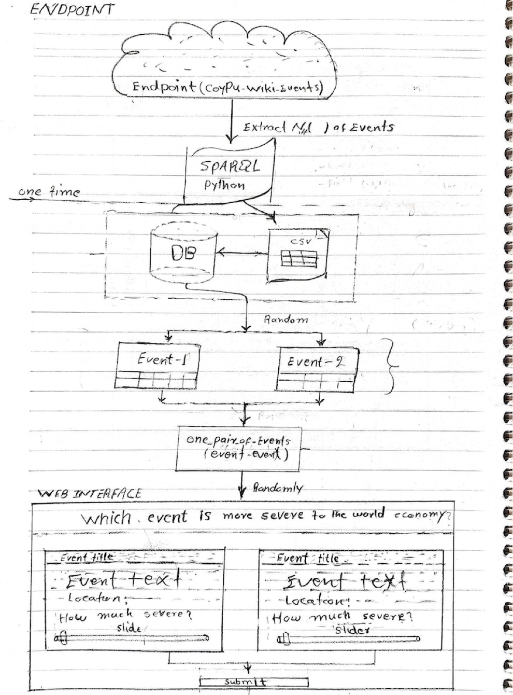
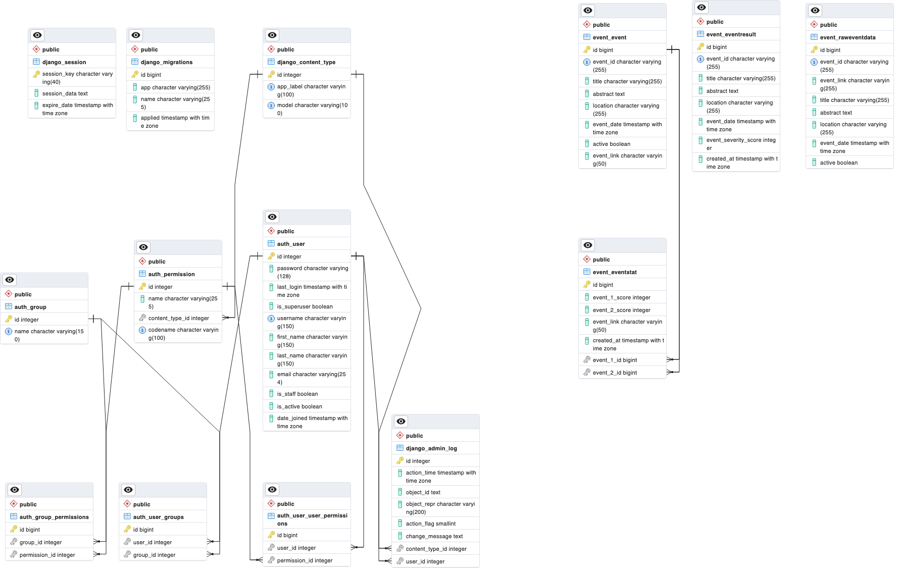
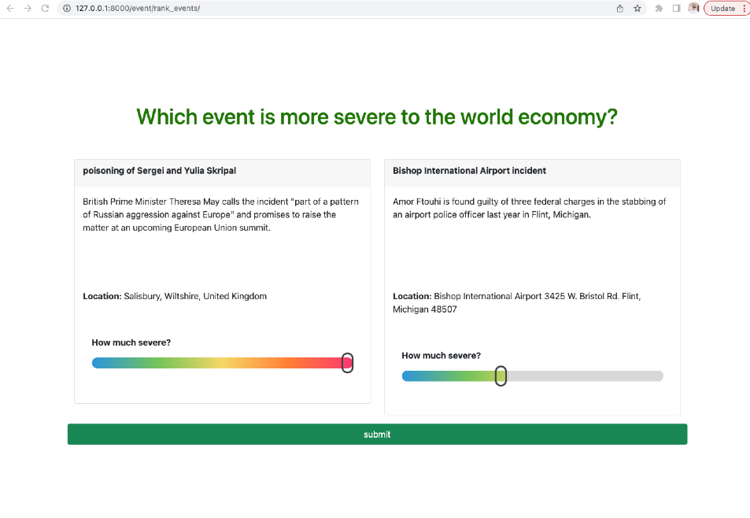

# [Event Severity Scorer](https://github.com/semantic-systems/coypu-event-severity-scorer)

## Project Description

Event-Severity-Scorer (ESS) is a pair-wise Event severity score system developed using Python and Django, with a Postgres database. The project aims to determine the severity of different events to the world economy based on their textual descriptions. Users are presented with two events and asked to decide which event is more severe. The severity score for each event is obtained from three different annotators, with scores ranging from 0 to 100. Once 1000 events have been annotated three times, the resulting dataset can be used to train a regression model capable of predicting the severity of future events.
### Conceptual Sketch Model


### ER Diagram


### Web Interface


## Installation

### Python

To install the Python dependencies for this project, please follow these steps:

1. Ensure that Python is installed on your system. You can download the latest version of Python from the official Python website (https://www.python.org).

2. Clone the project repository from GitHub using the following command:
   ```
   git clone <repository-url>
   ```

3. Navigate to the project directory:
   ```
   cd event-severity-scorer
   ```

4. Create a virtual environment to isolate the project dependencies (optional but recommended):
   ```
   python -m venv venv
   ```

5. Activate the virtual environment:
   - For Windows:
     ```
     venv\Scripts\activate
     ```
   - For macOS/Linux:
     ```
     source venv/bin/activate
     ```

6. Install the required Python packages:
   ```
   pip install -r requirements.txt
   ```

### Django

To install Django and set up the project, follow these instructions:

1. Ensure that the Python dependencies are installed by following the previous steps.

2. Navigate to the project directory if you are not already there:
   ```
   cd event-severity-scorer
   ```

3. Apply the database migrations:
   ```
   python manage.py migrate
   ```

### Postgres

To install and set up Postgres for the project, please follow these steps:

1. Download and install PostgreSQL from the official website (https://www.postgresql.org) based on your operating system.

2. Create a new database for the project in your PostgreSQL installation.

3. Configure the database connection settings in the project's `settings.py` file to match your PostgreSQL database configuration.

### Restoring the `db-backup.sql`

To restore the database backup for the project, follow these steps:

1. Ensure that you have the `db-backup.sql` file available.

2. Open a terminal or command prompt.

3. Navigate to the directory where the `db-backup.sql` file is located.

4. Run the following command to restore the database backup:
   ```
   psql -U <username> -d <database_name> -f db-backup.sql
   ```

   Replace `<username>` with your PostgreSQL username and `<database_name>` with the name of the database you want to restore the backup to.

### Running the Project in Docker

To run the project using Docker, please follow these steps:

1. Ensure that Docker is installed on your system. You can download Docker from the official Docker website (https://www.docker.com) based on your operating system.

2. Clone the project repository from GitHub using the following command:
   ```
   git clone <repository-url>
   ```

3. Navigate to the project directory:
   ```
   cd event-severity-scorer
   ```

4. Build the Docker image:
   ```
   docker build -t event-severity-scorer .
   ```

5. Run the Docker container:
   ```
   docker run

